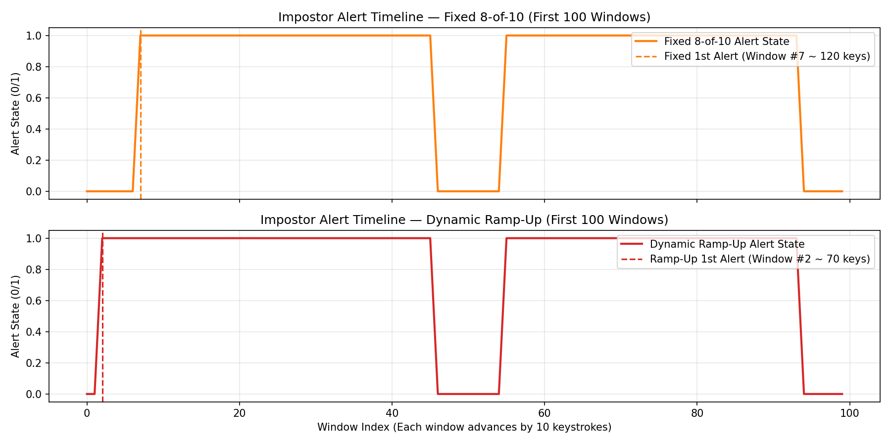

# Keystroke Continuous Authentication

A behavioral biometrics system that continuously verifies user identity based on free-text typing patterns. Unlike traditional password-based authentication, which verifies identity only at login, this system monitors typing behavior throughout an active session and raises an alert if the observed pattern deviates significantly from the authorized user's established baseline.

## Motivation

Most keystroke dynamics research and commercial systems (e.g., typing-based multi-factor authentication) rely on fixed-text input, where the user types the same string (such as a password) repeatedly. This project instead addresses **free-text continuous authentication**, a harder and comparatively less-explored problem, where typing behavior is monitored across arbitrary, unconstrained text rather than a fixed phrase.

This system is designed to complement, not replace, traditional authentication. It targets a different threat model: verifying that the person actively using a device after login is still the authorized user, rather than authenticating identity at a single point of entry.

## Privacy Design

The system captures only keystroke timing metadata: key-press and key-release timestamps. No sequences of typed content are persisted as readable text; timing data is processed into statistical features and the raw log is not used to reconstruct what was typed.

## How It Works

1. A background listener records key-press and key-release timestamps for each keystroke.
2. Raw timestamps are converted into two core timing metrics per key: dwell time (how long a key is held) and flight time (the gap between consecutive keys).
3. These metrics are aggregated over sliding windows of keystrokes into a fixed-length feature vector (average/standard deviation of dwell and flight time, typing speed, backspace rate).
4. An Isolation Forest model, trained exclusively on the authorized user's own baseline data, learns the shape of "normal" typing behavior.
5. Incoming windows are scored for anomaly. A sustained pattern of anomalous scores across multiple consecutive windows, rather than a single flagged window, triggers an alert, reducing false positives from momentary variation.

## Project Status

- **Phase 1 — Data Collection**: ✅ Complete. Background keystroke listener (`01_keystroke_collector.py`) logs press/release timestamps to CSV with no typed content persisted.
- **Phase 2 — Feature Engineering**: ✅ Complete. Sliding-window pipeline (`02_feature_extraction.ipynb`) extracts 9 features per window: avg/std dwell, avg/std flight, typing speed, backspace rate, avg space dwell, overlap rate, long pause rate.
- **Phase 3 — Model Training & Evaluation**: ✅ Complete. Isolation Forest trained on genuine baseline data (`03_model_training.ipynb`). FAR/FRR curves and EER analysis complete. **EER = 10.9%** at threshold `−0.0518`.
- **Phase 4 — Decision Logic**: ✅ Complete. Majority-vote buffer (`04_decision_logic.ipynb`) smooths per-window scores into session-level alerts. See results below.
- **Phase 5 — Real-Time Integration & Dynamic Ramp-Up**: 🔄 In Progress. Dynamic Ramp-Up consensus buffer (`05_real_time_simulation.ipynb`) cuts detection latency to ~70 keystrokes (~14 words) with 0.0% false alarms; streaming simulation verified.
- **Phase 6 — Evaluation & Write-Up**: 🔲 Planned. Drift analysis across sessions/days; arXiv preprint or undergraduate symposium submission.

## Repository Structure

```
.
├── src/
│   └── 01_keystroke_collector.py        # Phase 1: keystroke timing collector
├── notebooks/
│   ├── 02_feature_extraction.ipynb      # Phase 2: raw log → windowed feature vectors
│   ├── 03_model_training.ipynb          # Phase 3: Isolation Forest training & EER evaluation
│   ├── 04_decision_logic.ipynb          # Phase 4: majority-vote buffer & session-level analysis
│   └── 05_real_time_simulation.ipynb    # Phase 5: dynamic ramp-up & real-time streaming simulation
├── data/
│   └── keystroke_log_genuine.csv        # Baseline keystroke data (authorized user)
├── results/
│   ├── far_frr_curve.png                # FAR/FRR curve with EER marked
│   └── ramp_up_latency_comparison.png   # Latency comparison: Fixed 8-of-10 vs Dynamic Ramp-Up
├── .gitignore
└── README.md
```

## Requirements

- Python 3.10+
- pynput
- pandas
- numpy
- scikit-learn
- matplotlib
- joblib

```
pip install pynput pandas numpy scikit-learn matplotlib joblib
```

## Usage

### 1. Collect keystroke data
```
python src/01_keystroke_collector.py
```
Type naturally. Press ESC to stop and save.

### 2. Extract features
Run `notebooks/02_feature_extraction.ipynb` to convert the raw log into a windowed feature table.

### 3. Train the model
Run `notebooks/03_model_training.ipynb` to train the Isolation Forest, plot FAR/FRR, and save the model + scaler.

### 4. Run decision logic
Run `notebooks/04_decision_logic.ipynb` to simulate the majority-vote buffer on genuine and impostor sessions and review session-level alert statistics.

### 5. Simulate real-time dynamic ramp-up & streaming
Run `notebooks/05_real_time_simulation.ipynb` to evaluate the dynamic ramp-up consensus schedule ($3/3 \to 4/5 \to 8/10$) against the fixed 8-of-10 buffer, view the alert timeline plot, and simulate live keystroke streaming from raw logs.

## Results

### Model (Phase 3) — Per-Window Performance


| Metric | Value |
|---|---|
| Equal Error Rate (EER) | **10.9%** |
| Threshold at EER | `−0.0518` |
| FAR at EER | 11.4% |
| FRR at EER | 10.5% |

### Decision Logic (Phase 4) — Session-Level Performance

The decision buffer fires an alert when **≥ 8 of the last 10 windows** are anomalous. By evaluating an 80% majority across a 10-window sliding buffer, the system filters out transient typing variations while maintaining high sensitivity to sustained unauthorized typing.

#### Simulation Run Output (`notebooks/04_decision_logic.ipynb`)

```text
--- Genuine session (should have few/no alerts) ---
Total windows: 1024
Total alerts: 0
First alert at window index: None

--- Friend session (should alert, ideally early) ---
Total windows: 1011
Total alerts: 821
First alert at window index: 7
```

#### Session-Level Performance Summary

| Metric | Genuine User | Impostor |
|---|---|---|
| Total windows evaluated | 1,024 | 1,011 |
| Total alert windows | **0 (0.0%)** | **821 (81.2%)** |
| False alert / lockout rate | **0.0%** | — |
| Detection latency (First alert) | Never fired | **Window #7 (~120 keystrokes / ~24 words)** |
| Time in alert state | 0.0% | 81.2% |
| Alert episodes | 0 | 20 |
| Avg episode length | 0 keystrokes | ~410 keystrokes (~41.1 windows) |

Key findings:
- **Zero false alarms on genuine user**: Across 1,024 windows (~10,000 keystrokes), the genuine user never accumulates 8 anomalous windows in a 10-window span, completely eliminating false lockouts.
- **Fast and robust detection on impostor**: The impostor triggers the first alert after only ~120 keystrokes (~24 words), with the system remaining in the alert state for 81.2% of the impostor session.
- **Tolerance for brief timing overlaps**: Requiring 8 of 10 windows rather than a strict 10-of-10 streak ensures that even if an impostor happens to type a common word (e.g., "the") that momentarily scores as normal, detection is maintained without resetting the alert state.

### Dynamic Ramp-Up (Phase 5) — Latency Optimization



While the Phase 4 fixed 8-of-10 buffer eliminated false alarms, requiring 8 consecutive anomalous windows introduced cold-start latency (120 keystrokes / ~24 words). The **Dynamic Ramp-Up Buffer** scales the consensus threshold proportionally as the buffer fills:
- Window 3 (~70 keys / ~14 words): Requires **3 of 3 (100% consensus)**
- Windows 4–5 (~80–90 keys): Requires **≥ 4 anomalous windows**
- Windows 6–7 (~100–110 keys): Requires **≥ 6 anomalous windows**
- Windows 8–9 (~120–130 keys): Requires **≥ 7 anomalous windows**
- Window 10+ (saturated): Requires **≥ 8 of 10 anomalous windows**

#### Empirical Comparison on Project Data (`notebooks/05_real_time_simulation.ipynb`)

| Strategy | Genuine False Alert Rate | Impostor Detection Latency | Impostor Alert Windows |
|---|---|---|---|
| **Fixed 8-of-10 Buffer** | **0.00%** (0 / 1,024) | Window #7 (~120 keys / ~24 words) | 821 / 1,011 (81.21%) |
| **Dynamic Ramp-Up Buffer** | **0.00%** (0 / 1,024) | **Window #2 (~70 keys / ~14 words)** | **826 / 1,011 (81.70%)** |

**Impact**: Detection latency is reduced by **42% (50 fewer keystrokes)**, catching unauthorized actors significantly faster while maintaining zero false lockouts for genuine typing.

## Evaluation Methodology

- **FAR (False Acceptance Rate)**: fraction of impostor windows scored below the anomaly threshold (wrongly accepted).
- **FRR (False Rejection Rate)**: fraction of genuine windows scored above the anomaly threshold (wrongly flagged).
- **EER (Equal Error Rate)**: threshold where FAR ≈ FRR; standard single-number summary metric in keystroke dynamics literature.

## Limitations

- No defence against replay attacks using captured timing metadata from a prior session.
- Baseline generalization depends on data diversity — a baseline from a single narrow session may not reflect natural drift across time of day, keyboard, or fatigue.
- Classical Isolation Forest chosen for lightness and interpretability over deep-learning alternatives.

## Research Context

Free-text continuous authentication (as opposed to fixed-text / password-based keystroke dynamics) is a comparatively open research problem. This project targets sliding-window decision smoothing and multi-day robustness analysis using classical anomaly detection, with the goal of a research write-up for an arXiv preprint or undergraduate symposium.

## License

To be determined.
