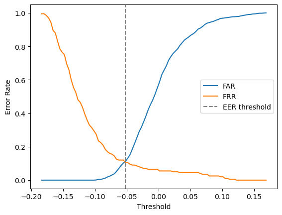

# Keystroke Continuous Authentication

A behavioral biometrics system that continuously verifies user identity based on free-text typing patterns. Unlike traditional password-based authentication, which verifies identity only at login, this system monitors typing behavior throughout an active session and raises an alert if the observed pattern deviates significantly from the authorized user's established baseline.

## Motivation

Most keystroke dynamics research and commercial systems (e.g., typing-based multi-factor authentication) rely on fixed-text input, where the user types the same string (such as a password) repeatedly. This project instead addresses **free-text continuous authentication**, a harder and comparatively less-explored problem, where typing behavior is monitored across arbitrary, unconstrained text rather than a fixed phrase.

This system is designed to complement, not replace, traditional authentication. It targets a different threat model: verifying that the person actively using a device after login is still the authorized user, rather than authenticating identity at a single point of entry.

## Privacy Design

The system captures only keystroke timing metadata: key-press and key-release timestamps. No sequences of typed content are persisted as readable text; timing data is processed into statistical features and the raw log is not used to reconstruct what was typed.

## How It Works

1. A background listener records key-press and key-release timestamps for each keystroke.
2. Raw timestamps are converted into two core timing metrics per key: dwell time (how long a key is held) and flight time (the gap between consecutive keys).
3. These metrics are aggregated over sliding windows of keystrokes into a fixed-length feature vector (average/standard deviation of dwell and flight time, typing speed, backspace rate).
4. An Isolation Forest model, trained exclusively on the authorized user's own baseline data, learns the shape of "normal" typing behavior.
5. Incoming windows are scored for anomaly. A sustained pattern of anomalous scores across multiple consecutive windows, rather than a single flagged window, triggers an alert, reducing false positives from momentary variation.

## Project Status

- **Phase 1 — Data Collection**: ✅ Complete. Background keystroke listener (`01_keystroke_collector.py`) logs press/release timestamps to CSV with no typed content persisted.
- **Phase 2 — Feature Engineering**: ✅ Complete. Sliding-window pipeline (`02_feature_extraction.ipynb`) extracts 9 features per window: avg/std dwell, avg/std flight, typing speed, backspace rate, avg space dwell, overlap rate, long pause rate.
- **Phase 3 — Model Training & Evaluation**: ✅ Complete. Isolation Forest trained on genuine baseline data (`03_model_training.ipynb`). FAR/FRR curves and EER analysis complete. **EER = 10.9%** at threshold `−0.0518`.
- **Phase 4 — Decision Logic**: ✅ Complete. Majority-vote buffer (`04_decision_logic.ipynb`) smooths per-window scores into session-level alerts. See results below.
- **Phase 5 — Real-Time Integration**: 🔲 Planned. Background service with system notifications / lock-screen trigger on sustained anomaly.
- **Phase 6 — Evaluation & Write-Up**: 🔲 Planned. Drift analysis across sessions/days; arXiv preprint or undergraduate symposium submission.

## Repository Structure

```
.
├── src/
│   └── 01_keystroke_collector.py     # Phase 1: keystroke timing collector
├── notebooks/
│   ├── 02_feature_extraction.ipynb   # Phase 2: raw log → windowed feature vectors
│   ├── 03_model_training.ipynb       # Phase 3: Isolation Forest training & EER evaluation
│   └── 04_decision_logic.ipynb       # Phase 4: majority-vote buffer & session-level analysis
├── data/
│   └── keystroke_log_genuine.csv     # Baseline keystroke data (authorized user)
├── results/
│   └── far_frr_curve.png             # FAR/FRR curve with EER marked
├── .gitignore
└── README.md
```

## Requirements

- Python 3.10+
- pynput
- pandas
- numpy
- scikit-learn
- matplotlib
- joblib

```
pip install pynput pandas numpy scikit-learn matplotlib joblib
```

## Usage

### 1. Collect keystroke data
```
python src/01_keystroke_collector.py
```
Type naturally. Press ESC to stop and save.

### 2. Extract features
Run `notebooks/02_feature_extraction.ipynb` to convert the raw log into a windowed feature table.

### 3. Train the model
Run `notebooks/03_model_training.ipynb` to train the Isolation Forest, plot FAR/FRR, and save the model + scaler.

### 4. Run decision logic
Run `notebooks/04_decision_logic.ipynb` to simulate the majority-vote buffer on genuine and impostor sessions and review session-level alert statistics.

## Results

### Model (Phase 3) — Per-Window Performance



| Metric | Value |
|---|---|
| Equal Error Rate (EER) | **10.9%** |
| Threshold at EER | `−0.0518` |
| FAR at EER | 11.4% |
| FRR at EER | 10.5% |

### Decision Logic (Phase 4) — Session-Level Performance

The majority-vote buffer fires an alert when **≥ 3 of the last 5 windows** are anomalous. Because adjacent windows share ~80% of their keystrokes (50-keystroke window, 10-keystroke slide step), they are highly correlated — so the buffer's primary role is **debouncing momentary spikes** rather than reducing error rates statistically.

| Metric | Genuine User | Impostor |
|---|---|---|
| Alert episodes per session | 19 | 19 |
| Avg episode length | ~49 keystrokes | ~491 keystrokes |
| Avg gap between episodes | ~450 keystrokes | ~41 keystrokes |
| Time in alert state | ~9% | ~92% |
| First alert fired at | ~260 keystrokes | ~20 keystrokes |

The key discriminator is the **shape** of the alert pattern, not whether alerts fire at all:
- **Genuine user**: brief spikes (~49 keystrokes) with long quiet spells (~450 keystrokes) that self-resolve quickly.
- **Impostor**: sustained alarms (~491 keystrokes) with tiny gaps (~41 keystrokes).

A persistence threshold (e.g. "alert state > X% of last 100 windows → lock screen") cleanly separates the two patterns and is the intended trigger for Phase 5.

## Evaluation Methodology

- **FAR (False Acceptance Rate)**: fraction of impostor windows scored below the anomaly threshold (wrongly accepted).
- **FRR (False Rejection Rate)**: fraction of genuine windows scored above the anomaly threshold (wrongly flagged).
- **EER (Equal Error Rate)**: threshold where FAR ≈ FRR; standard single-number summary metric in keystroke dynamics literature.

## Limitations

- No defence against replay attacks using captured timing metadata from a prior session.
- Baseline generalization depends on data diversity — a baseline from a single narrow session may not reflect natural drift across time of day, keyboard, or fatigue.
- Classical Isolation Forest chosen for lightness and interpretability over deep-learning alternatives.

## Research Context

Free-text continuous authentication (as opposed to fixed-text / password-based keystroke dynamics) is a comparatively open research problem. This project targets sliding-window decision smoothing and multi-day robustness analysis using classical anomaly detection, with the goal of a research write-up for an arXiv preprint or undergraduate symposium.

## License

To be determined.
